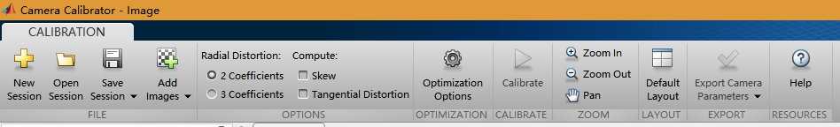
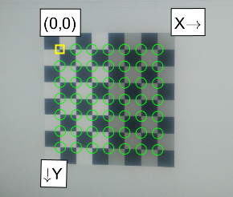
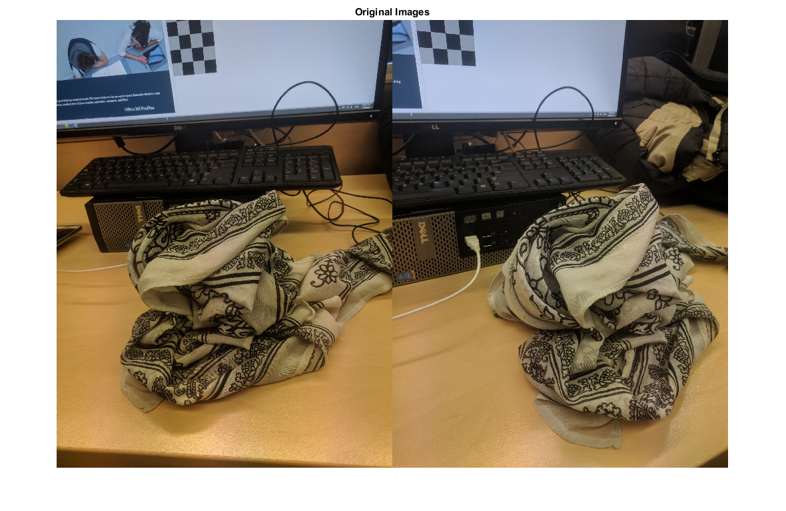
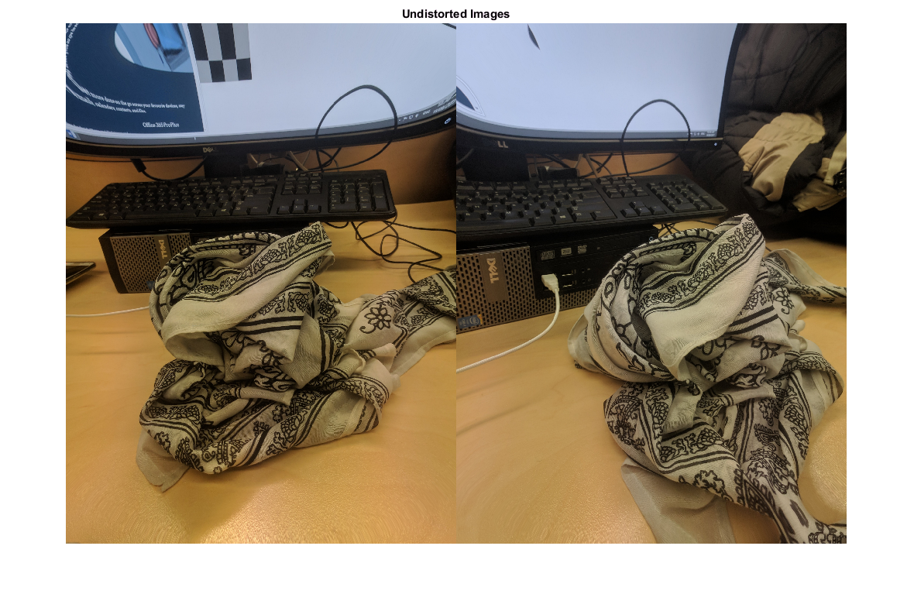
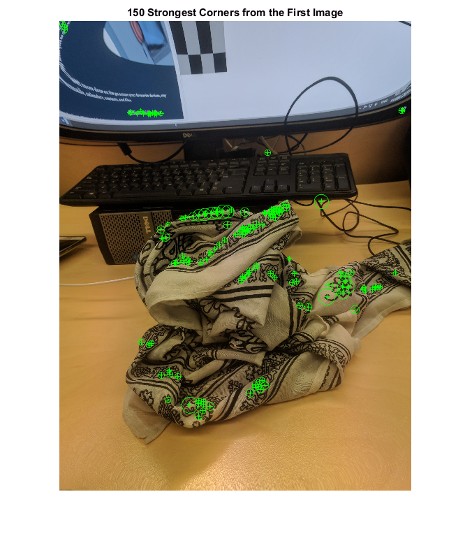
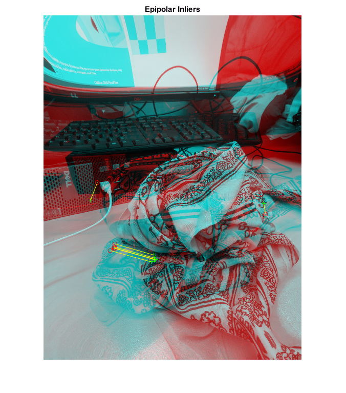
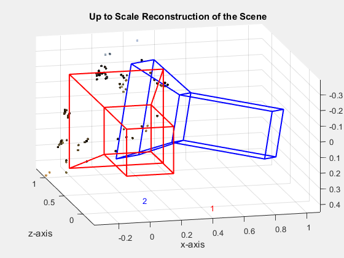

# computer vision - Structure From Motion From Two Views - matlab
the choose of scene should have as many features as possible, which means there should be many irregular shapes and the choosing should avoid plain places.

# generate camera parameters
1. Use ‘[checkerboard](https://au.mathworks.com/help/images/ref/checkerboard.html)’ to create a checkerboard image for camera calibration

```matlab
I = checkerboard(20);
imshow(I)
```

2. take photos of the checkerboard and record the physical size of the checkerboard on screen or on paper
3. Use ‘cameraCalibrator’ app to estimate parameters of a single camera

  - open 'Camera Calibration App' in matlab
  - add images to add checkerboard photos
  - enter the physical size of the checkerboard
  - delte the images with wrong directions (0,0 is the start point; x is the horizontal direction; y is the vertical direction)
  - 
  - calibrate
  - export to save the parameters as cameraParams variable

# read and show images
```matlab
i1 = imread('5.jpg');
i2 = imread('6.jpg');
figure
imshowpair(i1, i2, 'montage');
title('Original Images');
```


# undistort images and show
```matlab
I1 = undistortImage(i1,cameraParams);
I2 = undistortImage(i2,cameraParams);
figure
imshowpair(I1, I2, 'montage');
title('Undistorted Images');
```


# detect feature points
```matlab
% Detect feature points
imagePoints1 = detectSURFFeatures(rgb2gray(I1));
% Visualize detected points
figure
imshow(I1, 'InitialMagnification', 50);
title('150 Strongest Corners from the First Image');
hold on
plot(selectStrongest(imagePoints1, 150));
```


# create the point tracker
```matlab
% Create the point tracker
tracker = vision.PointTracker('MaxBidirectionalError', 1, 'NumPyramidLevels', 5);
% Initialize the point tracker
imagePoints1 = imagePoints1.Location;
initialize(tracker, imagePoints1, I1);
% Track the points
[imagePoints2, validIdx] = step(tracker, I2);
matchedPoints1 = imagePoints1(validIdx, :);
matchedPoints2 = imagePoints2(validIdx, :);
% Visualize correspondences
figure
showMatchedFeatures(I1, I2, matchedPoints1, matchedPoints2);
title('Tracked Features');
```


# create epipolar Inliers
```matlab
% Estimate the fundamental matrix
[E, epipolarInliers] = estimateEssentialMatrix(...
    matchedPoints1, matchedPoints2, cameraParams, 'Confidence', 99.99);
% Find epipolar inliers
inlierPoints1 = matchedPoints1(epipolarInliers, :);
inlierPoints2 = matchedPoints2(epipolarInliers, :);
% Display inlier matches
figure
showMatchedFeatures(I1, I2, inlierPoints1, inlierPoints2);
Warning: Image is too big to fit on screen; displaying at 17%
title('Epipolar Inliers');
```


# create tracker and track the points
```matlab
% Compute the Camera Pose
[orient, loc] = relativeCameraPose(E, cameraParams, inlierPoints1, inlierPoints2);
% Detect dense feature points. Use an ROI to exclude points close to the
% image edges.
roi = [30, 30, size(I1, 2) - 30, size(I1, 1) - 30];
imagePoints1 = detectMinEigenFeatures(rgb2gray(I1), 'ROI', roi, ...
    'MinQuality', 0.001);
% Create the point tracker
tracker = vision.PointTracker('MaxBidirectionalError', 1, 'NumPyramidLevels', 5);
% Initialize the point tracker
imagePoints1 = imagePoints1.Location;
initialize(tracker, imagePoints1, I1);
% Track the points
[imagePoints2, validIdx] = step(tracker, I2);
matchedPoints1 = imagePoints1(validIdx, :);
matchedPoints2 = imagePoints2(validIdx, :);
```

# recontruct points
```matlab
% Compute the camera matrices for each position of the camera
% The first camera is at the origin looking along the Z-axis. Thus, its
% rotation matrix is identity, and its translation vector is 0.
camMatrix1 = cameraMatrix(cameraParams, eye(3), [0 0 0]);
% Compute extrinsics of the second camera
[R, t] = cameraPoseToExtrinsics(orient, loc);
camMatrix2 = cameraMatrix(cameraParams, R, t);
% Compute the 3-D points
points3D = triangulate(matchedPoints1, matchedPoints2, camMatrix1, camMatrix2);
% Get the color of each reconstructed point
numPixels = size(I1, 1) * size(I1, 2);
allColors = reshape(I1, [numPixels, 3]);
colorIdx = sub2ind([size(I1, 1), size(I1, 2)], round(matchedPoints1(:,2)), ...
    round(matchedPoints1(:, 1)));
color = allColors(colorIdx, :);
% Create the point cloud
ptCloud = pointCloud(points3D, 'Color', color);
% Visualize the camera locations and orientations
cameraSize = 0.3;
figure
plotCamera('Size', cameraSize, 'Color', 'r', 'Label', '1', 'Opacity', 0);
hold on
grid on
plotCamera('Location', loc, 'Orientation', orient, 'Size', cameraSize, ...
    'Color', 'b', 'Label', '2', 'Opacity', 0);
% Visualize the point cloud
pcshow(ptCloud, 'VerticalAxis', 'y', 'VerticalAxisDir', 'down', ...
    'MarkerSize', 45);
% Rotate and zoom the plot
camorbit(0, -30);
camzoom(1.5);
% Label the axes
xlabel('x-axis');
ylabel('y-axis');
zlabel('z-axis')
title('Up to Scale Reconstruction of the Scene');
```


# source
Structure From Motion From Two Views: https://au.mathworks.com/help/vision/examples/structure-from-motion-from-two-views.html
