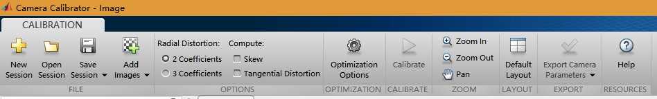
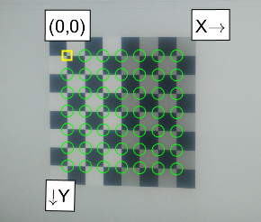
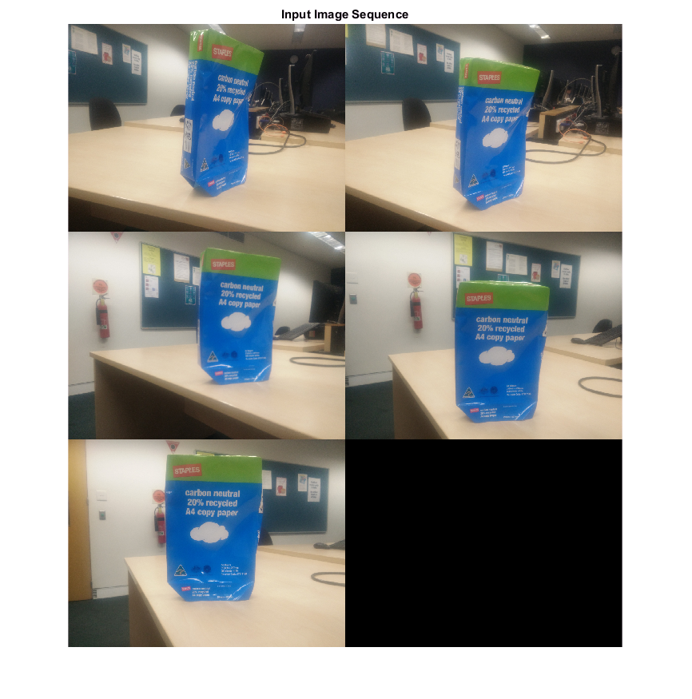
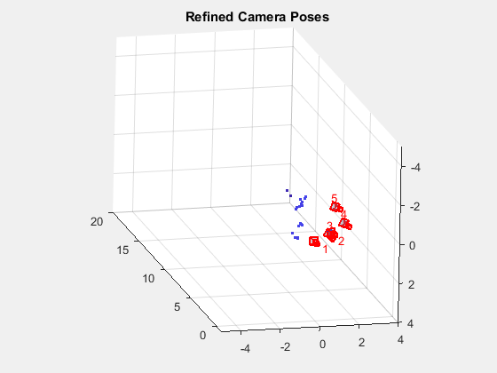
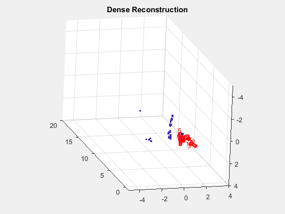

# key
the choose of scene should have as many features as possible, which means there should be many irregular shapes and the choosing should avoid plain places.

# generate camera parameters
1. Use ‘[checkerboard](https://au.mathworks.com/help/images/ref/checkerboard.html)’ to create a checkerboard image for camera calibration

```matlab
I = checkerboard(20);
imshow(I)
```

2. take photos of the checkerboard and record the physical size of the checkerboard on screen or on paper
3. Use ‘cameraCalibrator’ app to estimate parameters of a single camera

  - open 'Camera Calibration App' in matlab
  - add images to add checkerboard photos
  - enter the physical size of the checkerboard
  - delte the images with wrong directions (0,0 is the start point; x is the horizontal direction; y is the vertical direction)
  - calibrate
  - export to save the parameters as cameraParams.mat


# Read the input image Sequence
images are stored in photos folder
```matlab
% acquire images from folder
imds = imageDatastore('./photos');

% Display the images.
figure
montage(imds.Files, 'Size', [3, 2]);

% Convert the images to grayscale.
images = cell(1, numel(imds.Files));
for i = 1:numel(imds.Files)
    I = readimage(imds, i);
    images{i} = rgb2gray(I);
end

title('Input Image Sequence');
```


# load Camera Parameters
```matlab
load(fullfile('./', 'cameraParams.mat'));
save('step1.mat');
```
# Create a View Set Containing the First View
```matlab
load('step1.mat');
% Undistort the first image.
I = undistortImage(images{1}, cameraParams);
% Detect features. Increasing 'NumOctaves' helps detect large-scale
% features in high-resolution images. Use an ROI to eliminate spurious
% features around the edges of the image.
border = 50;
roi = [border, border, size(I, 2)- 2*border, size(I, 1)- 2*border];
prevPoints   = detectSURFFeatures(I, 'NumOctaves', 8, 'ROI', roi);
% Extract features. Using 'Upright' features improves matching, as long as
% the camera motion involves little or no in-plane rotation.
prevFeatures = extractFeatures(I, prevPoints, 'Upright', true);
% Create an empty viewSet object to manage the data associated with each
% view.
vSet = viewSet;
% Add the first view. Place the camera associated with the first view
% and the origin, oriented along the Z-axis.
viewId = 1;
vSet = addView(vSet, viewId, 'Points', prevPoints, 'Orientation', ...
    eye(3, 'like', prevPoints.Location), 'Location', ...
    zeros(1, 3, 'like', prevPoints.Location));
save('step2.mat');
```
# Add the Rest of the Views
```matlab
load('step2.mat');
for i = 2:numel(images)
    % Undistort the current image.
    I = undistortImage(images{i}, cameraParams);
    % Detect, extract and match features.
    currPoints   = detectSURFFeatures(I, 'NumOctaves', 8, 'ROI', roi);
    currFeatures = extractFeatures(I, currPoints, 'Upright', true);
    indexPairs = matchFeatures(prevFeatures, currFeatures, ...
        'MaxRatio', .25, 'Unique',  true);
    % Select matched points.
    matchedPoints1 = prevPoints(indexPairs(:, 1));
    matchedPoints2 = currPoints(indexPairs(:, 2));
    % Estimate the camera pose of current view relative to the previous view.
    % The pose is computed up to scale, meaning that the distance between
    % the cameras in the previous view and the current view is set to 1.
    % This will be corrected by the bundle adjustment.
    [relativeOrient, relativeLoc, inlierIdx] = helperEstimateRelativePose(...
        matchedPoints1, matchedPoints2, cameraParams);
    % Add the current view to the view set.
    vSet = addView(vSet, i, 'Points', currPoints);
    % Store the point matches between the previous and the current views.
    vSet = addConnection(vSet, i-1, i, 'Matches', indexPairs(inlierIdx,:));
    % Get the table containing the previous camera pose.
    prevPose = poses(vSet, i-1);
    prevOrientation = prevPose.Orientation{1};
    prevLocation    = prevPose.Location{1};
    % Compute the current camera pose in the global coordinate system
    % relative to the first view.
    orientation = relativeOrient * prevOrientation;
    location    = prevLocation + relativeLoc * prevOrientation;
    vSet = updateView(vSet, i, 'Orientation', orientation, ...
        'Location', location);
    % Find point tracks across all views.
    tracks = findTracks(vSet);
    % Get the table containing camera poses for all views.
    camPoses = poses(vSet);
    % Triangulate initial locations for the 3-D world points.
    xyzPoints = triangulateMultiview(tracks, camPoses, cameraParams);
    % Refine the 3-D world points and camera poses.
    [xyzPoints, camPoses, reprojectionErrors] = bundleAdjustment(xyzPoints, ...
        tracks, camPoses, cameraParams, 'FixedViewId', 1, ...
        'PointsUndistorted', true);
    % Store the refined camera poses.
    vSet = updateView(vSet, camPoses);
    prevFeatures = currFeatures;
    prevPoints   = currPoints;
end
save('step3.mat');
```
# Display Camera Poses
```matlab
load('step3.mat');
% Display camera poses.
camPoses = poses(vSet);
figure;
plotCamera(camPoses, 'Size', 0.2);
hold on
% Exclude noisy 3-D points.
goodIdx = (reprojectionErrors < 5);
xyzPoints = xyzPoints(goodIdx, :);
% Display the 3-D points.
pcshow(xyzPoints, 'VerticalAxis', 'y', 'VerticalAxisDir', 'down', ...
    'MarkerSize', 45);
grid on
hold off
% Specify the viewing volume.
loc1 = camPoses.Location{1};
xlim([loc1(1)-5, loc1(1)+4]);
ylim([loc1(2)-5, loc1(2)+4]);
zlim([loc1(3)-1, loc1(3)+20]);
camorbit(0, -30);
title('Refined Camera Poses');
save('step4.mat');
```

# Compute Dense Reconstruction
```matlab
load('step4.mat');
% Read and undistort the first image
I = undistortImage(images{1}, cameraParams);
% Detect corners in the first image.
prevPoints = detectMinEigenFeatures(I, 'MinQuality', 0.001);
% Create the point tracker object to track the points across views.
tracker = vision.PointTracker('MaxBidirectionalError', 1, 'NumPyramidLevels', 6);
% Initialize the point tracker.
prevPoints = prevPoints.Location;
initialize(tracker, prevPoints, I);
% Store the dense points in the view set.
vSet = updateConnection(vSet, 1, 2, 'Matches', zeros(0, 2));
vSet = updateView(vSet, 1, 'Points', prevPoints);
% Track the points across all views.
for i = 2:numel(images)
    % Read and undistort the current image.
    I = undistortImage(images{i}, cameraParams);
    % Track the points.
    [currPoints, validIdx] = step(tracker, I);
    % Clear the old matches between the points.
    if i < numel(images)
        vSet = updateConnection(vSet, i, i+1, 'Matches', zeros(0, 2));
    end
    vSet = updateView(vSet, i, 'Points', currPoints);
    % Store the point matches in the view set.
    matches = repmat((1:size(prevPoints, 1))', [1, 2]);
    matches = matches(validIdx, :);
    vSet = updateConnection(vSet, i-1, i, 'Matches', matches);
end
% Find point tracks across all views.
tracks = findTracks(vSet);
% Find point tracks across all views.
camPoses = poses(vSet);
% Triangulate initial locations for the 3-D world points.
xyzPoints = triangulateMultiview(tracks, camPoses,...
    cameraParams);
% Refine the 3-D world points and camera poses.
[xyzPoints, camPoses, reprojectionErrors] = bundleAdjustment(...
    xyzPoints, tracks, camPoses, cameraParams, 'FixedViewId', 1, ...
    'PointsUndistorted', true);
save('step5.mat');
```
# Display Dense Reconstruction
```matlab
  load('step5.mat');
  % Display the refined camera poses.
  figure;
  plotCamera(camPoses, 'Size', 0.2);
  hold on
  % Exclude noisy 3-D world points.
  goodIdx = (reprojectionErrors < 5);
  % Display the dense 3-D world points.
  pcshow(xyzPoints(goodIdx, :), 'VerticalAxis', 'y', 'VerticalAxisDir', 'down', ...
      'MarkerSize', 45);
  grid on
  hold off
  % Specify the viewing volume.
  loc1 = camPoses.Location{1};
  xlim([loc1(1)-5, loc1(1)+4]);
  ylim([loc1(2)-5, loc1(2)+4]);
  zlim([loc1(3)-1, loc1(3)+20]);
  camorbit(0, -30);
  title('Dense Reconstruction');
```



# source
Structure From Motion From Multiple Views: https://au.mathworks.com/help/vision/examples/structure-from-motion-from-multiple-views.html
